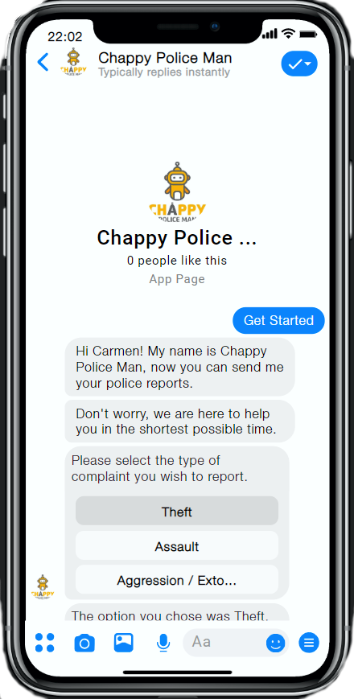

# Chappy Police Man

We listen daily to different events of citizen insecurity that unfortunately occur in our country and we know that we could be part of the statistics. Our authorities, despite doing their best to combat this situation, is not enough.
When these events occur, we seek prompt help from our police, however, our reporting system is manual, bureaucratic and cumbersome, this generates a loss of vital time to take action and in many cases, the report is not specified.
This is how Chappy is your friend bot, which seeks to eliminate all those barriers and be the bridge that allows us to simplify this search for help.

[Access the Messenger experience](https://www.messenger.com/t/111154927148468)



## How we build it

After brainstorming, we finally opted for the idea of helping people connect with the police service quickly and easily through an interactive chat.
For that, we support ourselves with the following technologies:

1. Node.js: A JavaScript runtime built on Chrome's V8 JavaScript engine
2. Express.js: Fast, unopinionated, minimalist web framework for Node.js
3. i18n: Lightweight simple translation module with dynamic json storage
4. Pdfkit: PDF document generation library for Node and the browser that makes creating complex, multi-page, printable documents easy.
5. Original Coast Clothing: Is a Messenger bot for a fictional clothing brand created to showcase key features of the Messenger Platform. 
6. Facebook API: Set of definitions and protocols for building and integrating Facebook into your apps.
## Requirements

- **Facebook Page:** Will be used as the identity of your messaging experience. When people chat with your page. To create a new Page, visit https://www.facebook.com/pages/create.
- **Facebook Developer Account:** Required to create new apps, which are the core of any Facebook integration. You can create a new developer account by going to the [Facebook Developers website](https://developers.facebook.com/) and clicking the "Get Started" button.
- **Facebook App:** Contains the settings for your Messenger automation, including access tokens. To create a new app, visit your [app dashboard](https://developers.facebook.com/apps).


#### How to boostrap Chappy Police Man

1. Go to your app Basic Settings, [Find your app here](https://developers.facebook.com/apps)
2. Save the **App ID** number and the **App Secret**

#### Grant  Messenger access to Chappy Police Man

1. Go to your app Dashboard
2. Under Add Product find Messenger and click Set Up
3. Now you should be in the App Messenger Settings
4. Under Access Tokens, click on Edit Permissions
5. Select the desired page and allow Manage and access Page conversations in Messenger
6. Select the desired page and an access token should appear
7. Get the Page ID from the page access token by using the [Access Token Debugger](https://developers.facebook.com/tools/debug/accesstoken/)
8. In the section Built-In NLP, select your page and enable the toggle

# Installation

Clone this repository on your local machine:

```bash
$ git clone https://github.com/nickthewitcher/chappy-police-man.git
$ cd chappy-police-man
```

You will need:

- [Node](https://nodejs.org/en/) 12.x or higher
- [Azure](https://azure.microsoft.com/) or remote server like [Heroku](https://www.heroku.com/) 

# Usage

## Using Heroku
#### 1. Install the Heroku CLI

Download and install the [Heroku CLI](https://devcenter.heroku.com/articles/heroku-cli)

#### 2. Create an app from the CLI

```bash
git init
heroku apps:create
# Creating app... done, ⬢ mystic-wind-83
# Created http://mystic-wind-83.herokuapp.com/ | git@heroku.com:mystic-wind-83.git
```

#### 3. Deploy the code
```bash
git add .
git commit -m "My first commit"
git push heroku master
```

#### 4. Set your environment variables
  In your Heroku App Dashboard [https://dashboard.heroku.com/apps/mystic-wind-83](https://dashboard.heroku.com/apps/mystic-wind-83) set up the config vars following the comments in the file ```.sample.env```

#### 5. Configure your webhook subscription and set the Messenger profile
  You should now be able to access the application. Use the ```VERIFY_TOKEN``` that you created as config vars and call the **/profile** endpoint like so:

  ```
  http://mystic-wind-83.herokuapp.com/profile?mode=all&verify_token=verify-token
  ```

#### 6. Test that your app setup is successful

  Send a message to your Page from Facebook or in Messenger, if your webhook receives an event, you have fully set up Chappy Police Man!

## License
Chappy Police Man is based in the Sample Messenger App Original Coast Clothing which is BSD licensed, as found in the LICENSE file.

See the [CONTRIBUTING](CONTRIBUTING.md) file for how to help out.